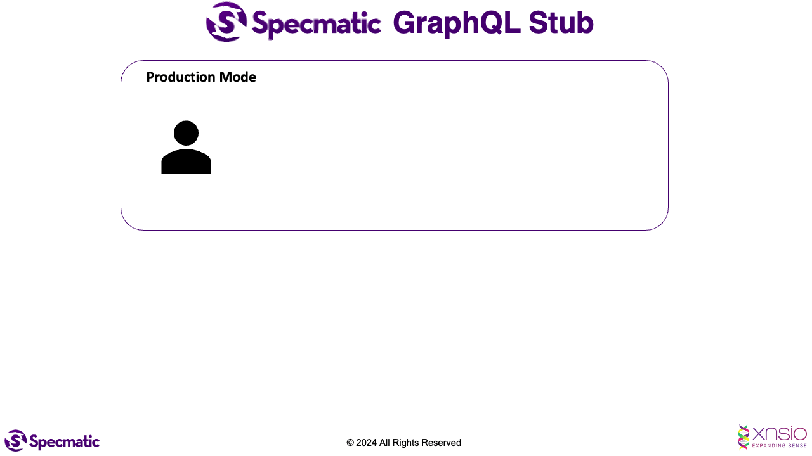

# Specmatic UI project for GraphQL demo

## Pre-requisites

Install the node packages for this project.

```shell
npm install
```

## Start up the Specmatic stub

```shell
npm run specmatic:stub
```

## Start the application

```shell
npm start
```

This should automatically start the application and pull it up in your browser.

## Explore the GraphQl spec using GraphiQL

```shell
npm run graphiql
```

You can now open [GraphiQL](http://localhost:4000/graphiql) in your browser and test out some GraphQL queries.

This instance of GraphiQL has been setup to query the Specmatic stub instance running on http://localhost:4000/graphql.
